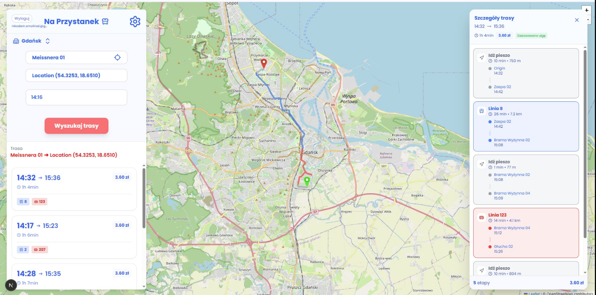

# Na Przystanek - Public Transport Trip Planner

Portfolio project built during university teamwork.

`Na Przystanek` is a full-stack web application for planning public transport trips in the Gdansk area. It combines an interactive map UI, OTP (OpenTripPlanner) route planning, geocoding, user accounts, and simple admin analytics.



## Why This Project

We built this project to practice real full-stack collaboration and work with production-like components:

- modern frontend with map interactions and responsive UI
- backend API with authentication and role-based access
- external routing engine (OpenTripPlanner)
- database design and data import workflows
- Docker-based local environment

## Key Features

- Plan trips between two points directly on the map
- Address and stop search with autocomplete
- Route proposals from OTP GraphQL
- Dynamic ticket pricing logic based on trip complexity
- User discount preferences (normal, reduced, senior/student)
- Registration, login, logout, Google login, and password change
- Admin panel with top searched phrases
- GTFS updater task scheduled daily (cron)

## Tech Stack

- Frontend: Next.js 16, React 19, Tailwind CSS 4, Framer Motion, Leaflet
- Backend: Node.js, Express, Mongoose, JWT, bcrypt
- Database: MongoDB 7
- Routing: OpenTripPlanner 2.8.1
- Containerization: Docker, Docker Compose

## Architecture

The application runs as four services:

- `frontend` (port `3000`) - Next.js web app
- `backend` (port `4000`) - Express REST API
- `otp` (port `8080`) - OpenTripPlanner instance
- `mongo` (port `27017`) - MongoDB

Main request flow:

1. User selects start and destination in the frontend.
2. Frontend calls backend geocoding endpoint (`/api/geocode`).
3. Frontend requests trip plans from OTP GraphQL endpoint.
4. Backend handles auth, user preferences, search history, and admin endpoints.

## API Overview

Main backend routes:

- `GET /api/health`
- `POST /api/auth/register`
- `POST /api/auth/login`
- `POST /api/auth/google`
- `POST /api/auth/logout`
- `GET /api/auth/me`
- `POST /api/auth/change-password` (auth required)
- `PATCH /api/auth/preferences` (auth required)
- `GET /api/geocode?q=...`
- `GET /api/admin/top-searches` (admin required)
- `GET /api/ztm/fetch-displays`
- `GET /api/ztm/displays`

## Quick Start (Docker)

### 1. Prerequisites

- Docker Desktop
- Node.js 20+ (optional, only if running services outside Docker)

### 2. Required OTP File

Before running `docker compose`, download OTP jar:

- Download: `https://repo1.maven.org/maven2/org/opentripplanner/otp-shaded/2.8.1/otp-shaded-2.8.1.jar`
- Place it in: `backend/otp/otp-shaded-2.8.1.jar`

OTP container is configured to start with:

- `java -Xmx4G -jar otp-shaded-2.8.1.jar --load --serve ztm`

If you do not have a built graph yet, check `backend/otp/README.MD` for `--build` commands.

### 3. Run Services

From project root:

```bash
docker compose up --build
```

### 4. Open Application

- Frontend: `http://localhost:3000`
- Backend health: `http://localhost:4000/api/health`
- OTP API: `http://localhost:8080`

## Optional: Run Without Docker

### Backend

```bash
cd backend
npm install
npm run dev
```

### Frontend

```bash
cd frontend
npm install
npm run dev
```

You also need running MongoDB and OTP services, plus environment variables compatible with your local setup.

## Admin Account Helper

You can create or upgrade a user to admin with:

```bash
node backend/createAdmin.js <email> <password> <name>
```

Example:

```bash
node backend/createAdmin.js admin@example.com StrongPass! Jan
```

## Skills Demonstrated

- Building and integrating multi-service architecture
- Working with authentication, cookies, and protected routes
- Handling external APIs and transport data (GTFS)
- Designing interactive map UX with route visualization
- Writing maintainable modular code in frontend and backend
- Using Docker for reproducible development environments

## Known Limitations / Next Steps

- Improve dark mode consistency across all components
- Add real-time delays (GTFS-RT)
- Add full location tracking and better fallback behavior
- Expand test coverage (unit + integration)
- Add CI pipeline and deployment config

## Project Structure

```text
backend/
  src/
    controllers/
    middleware/
    models/
    routes/
    utils/
  otp/
frontend/
  src/
    app/
    components/
    contexts/
```


## License

Educational project. Add a formal license if you plan to publish it publicly.
